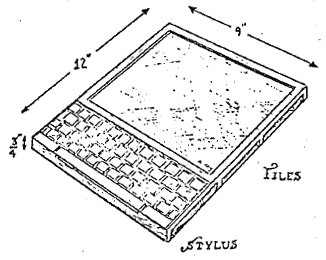

#Project Gomez

##What is it?

Envisioned as a mechanical keyboard with a battery and integrated ARM SoC (Raspberry Pi-family), "Gomez" is a *lot* like the old **Cambridge/Sinclair Z88**:

or **Tandy/Radio Shack [Model 100](https://www.youtube.com/watch?v=Prl6D7bqQo8)**:

..but really, more like Alan Kay's proposed '[DynaBook](https://www.mprove.de/diplom/gui/Kay72a.pdf)'.

###Today, it's just a bunch of bits.

##Who is it for?
This thing I'm calling 'Project Gomez' could be for anyone who wants or needs a mechanical keyboard with a basic (very basic) operating system installed.

This is very much function over fashion. 

##How can I get involved?
- [reddit](https://reddit.com/r/ProjectGomez)
- your PR
- [twitter](#)

##What is the point?
- Distraction-free writing
- Mechanical keyboard to suit one's tastes
- Portable Linux environment runs from SD-card
- Wifi, Bluetooth (host)
- Do-it-yourself
- It's Free (*as in Freedom*)

##Where can I get one?
Stay tuned.

----
