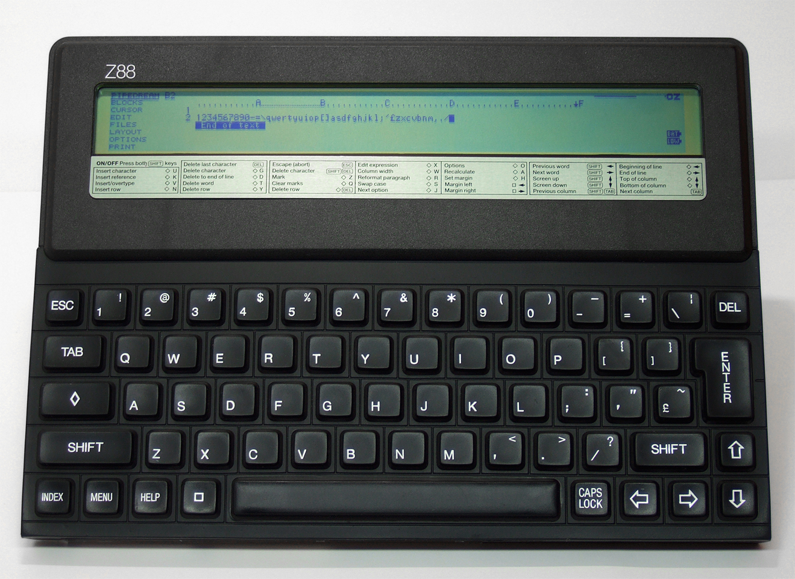
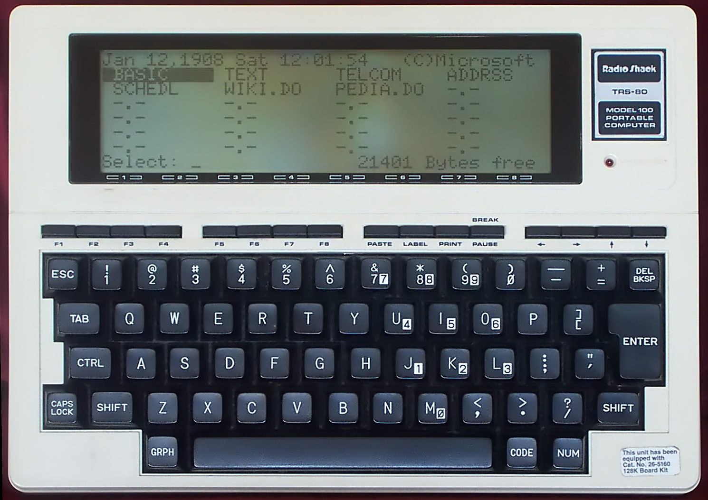

# Project Gomez

## What is it?

Envisioned as a mechanical keyboard with a battery and integrated ARM SoC (Raspberry Pi-family), "Gomez" is a *lot* like the old **Cambridge/Sinclair Z88**:

or **Tandy/Radio Shack [Model 100](https://www.youtube.com/watch?v=Prl6D7bqQo8)**:

..but really, more like Alan Kay's proposed '[DynaBook](https://www.mprove.de/diplom/gui/Kay72a.pdf)'.

### Today, it's just a bunch of bits.

## Who is it for?
This thing I'm calling 'Project Gomez' could be for anyone who wants or needs a mechanical keyboard with a basic (very basic) operating system installed.

This is very much function over fashion. 

## How can I get involved?
- [reddit](https://reddit.com/r/ProjectGomez)
- your PR
- [twitter](#)

## What is the point?
- Distraction-free writing
- Mechanical keyboard to suit one's tastes
- Portable Linux environment runs from SD-card
- Wifi, Bluetooth (host)
- Do-it-yourself
- It's Free (*as in Freedom*)

----

## Subsystems

### Keyboard ass'y

Leveraging OSH designs for 60% layout, Gomez has a usable keysurface

Mechanical keyswitches are an Eagle layout item; Cherry, ALPS, whatevs

This interfaces with the Backplane

### Backplane

The Gomez Backplane should conform to the case layout for port and mounting hole locations and provide connectivity between Key Assy and other subsystems connected to the Backplane:

- Battery
- Charging system
- Mezzanine (Raspi Zero-compatible SO-DIMM layout)
- GPIO/GeekPort

Does the backplane need I2C or other bus?

Will the backplane be expandible via side-connector?

Will the backplane have a docking port?

Will the backplane contain the switches, or will they ride on a carrier?

### Power

Gomez should rely on COTS battery technology, offering flexibility between 18550 cells or LiPo pack options.

Airline safety requirements limit the size of Lithium batteries to be taken on commercial flights. This can be extended with individual packs or custom options.

### Compute

Basic HID functions can be achieved with existing firmware for Teensy and Arduino. Incorporation of ATTiny or other Microprocessor/SoC/SoM is simple.

Mezzanine should provide general purpose CPU SoM access, targeting Raspi Zero in design phase.

### Display

Display format and formfactor are still up in the air. Classic implementations used a 80 character wide display, with only 20 or so vertial lines.

Gomez could utilize ePaper, OLED or other screen technology in addition to CFL or LED backlit IPS LCD panels.

### Storage

Leveraging online and SD storage is the plan.

Integrations with services like Evernote should be achievable.

### Operating System

Gomez should run a minimal operating system. A Buildroot-derived embedded distribution is in development.

The HID controller will run some combination of low-level code for charger and power management as well as the firmware for keyboard (mouse) decode.

### Input

Apart from the keyboard, no integrated pointing or touch functionality is anticipated in the official design at Revision 0.

Thinkpad-style trackpoint or other options are potential candidates. Extension via side port to accommodate external devices for IO should be anticipated.

### Output

Gomez should be able to render directly to a standard thermal printer module by leveraging other open designs, formatted for the Side Port.

Pointing or General Purpose IO can be packaged in modules for extension.
